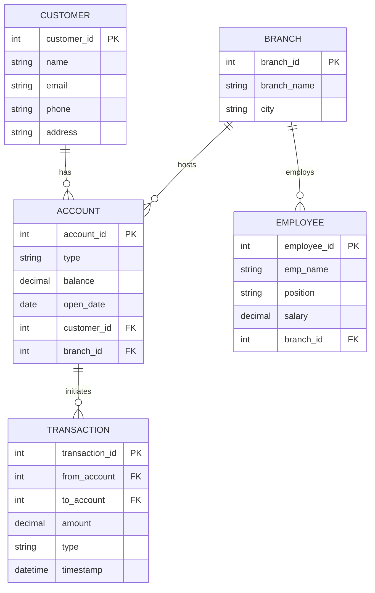

# Project Report: Banking Management System

## Step 1: Problem Definition
Traditional banking systems relying on manual ledger entries often struggle with data inconsistency, slow transaction processing times, and high risks of human error. The **Banking Management System** is a centralized DBMS-based application designed to automate these core operations. 

**Objectives:**
- To provide a secure and efficient way to manage customer and account information.
- To automate financial transactions (deposit, withdrawal, and transfers) with real-time balance updates.
- To ensure data integrity and security through relational database constraints.
- To facilitate easy retrieval of transaction history and branch reports.

---

## Step 2: Requirement Analysis

### 1. Entities & Attributes
- **Customer**: `CustomerID` (PK), `Name`, `Phone`, `Email`, `Address`, `DOB`.
- **Account**: `AccountID` (PK), `AccountType` (Savings/Current), `Balance`, `OpenDate`, `CustomerID` (FK), `BranchID` (FK).
- **Transaction**: `TransactionID` (PK), `FromAccountID` (FK), `ToAccountID` (FK), `Amount`, `Type` (Deposit/Withdrawal/Transfer), `Timestamp`.
- **Branch**: `BranchID` (PK), `BranchName`, `City`, `Address`.
- **Employee**: `EmployeeID` (PK), `EmpName`, `Position`, `Salary`, `BranchID` (FK).

### 2. Relationships (Cardinality)
- **Customer - Account (1:N)**: One customer can have multiple accounts (Savings, Current, etc.), but an account belongs to one primary customer.
- **Branch - Account (1:N)**: A branch can host many accounts, but an account is linked to one home branch.
- **Account - Transaction (1:N)**: An account can be involved in multiple transactions.
- **Branch - Employee (1:N)**: A branch has many employees, but an employee works at one branch.

### 3. Functional Requirements
1.  **User Registration**: Add new customers to the system.
2.  **Account Management**: Open new Savings or Current accounts.
3.  **Deposit/Withdrawal**: Update balances based on cash flow.
4.  **Fund Transfer**: Move money between two internal accounts securely.
5.  **Balance Inquiry**: Real-time checking of current available funds.
6.  **Transaction History**: View detailed logs of past activities.
7.  **Branch Management**: Capability to add or update bank branch locations.
8.  **Employee Records**: Tracking bank staff and their assigned branches.
9.  **Interest Calculation**: (Simulation) Applying interest to savings accounts.
10. **Admin Dashboard**: Overview of total deposits and active accounts.

### 4. Non-Functional Requirements
- **Integrity**: Strict enforcement of FK constraints and ACID properties.
- **Security**: Data encryption for sensitive information.
- **Performance**: Queries indexed for sub-second response times.
- **Usability**: Clean, modern UI for bank tellers and customers.

---

## Step 3: ER Diagram

---

## Step 4: Relational Tables & Normalization

### 1. Table Definitions
- **Customers** (`customer_id`, `name`, `email`, `phone`, `address`)
- **Accounts** (`account_id`, `customer_id`, `branch_id`, `type`, `balance`, `open_date`)
- **Branches** (`branch_id`, `branch_name`, `city`)
- **Transactions** (`transaction_id`, `from_account`, `to_account`, `amount`, `type`, `timestamp`)
- **Employees** (`employee_id`, `branch_id`, `emp_name`, `position`, `salary`)

### 2. Normalization Process

#### First Normal Form (1NF)
- **Rule**: No multi-valued attributes, every cell has atomic values.
- **Implementation**: The address field is simplified, and each customer/account has a unique identifier.

#### Second Normal Form (2NF)
- **Rule**: Must be in 1NF and all non-key attributes must be fully functionally dependent on the Primary Key.
- **Implementation**: We separated "Branch" details into its own table. Instead of storing `BranchName` and `BranchCity` in the `Account` table, we store a `BranchID`.

#### Third Normal Form (3NF)
- **Rule**: Must be in 2NF and have no transitive dependencies.
- **Implementation**: In the `Employee` table, we ensure that information about the branch stays in the `Branch` table. `Salary` is dependent on `Position`, but we keep them together as it's a direct attribute of the employee; if it were a complex pay scale, we would create a `Positions` table to eliminate redundancy.
